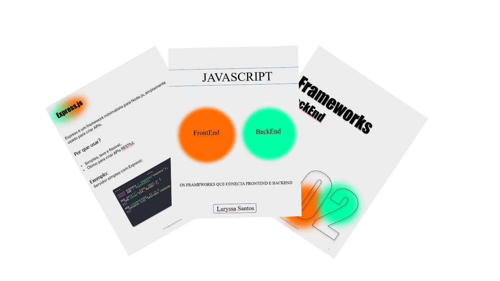

# Projeto EBOOK Gerado por I.A.s

 > ℹ️ **NOTE:** Este é o repositório desenvolvido durante o curso no qual fui aluna  na plataforma da [DIO](https://dio.me)

Projeto com o objetivo de gerar um ebook digital com as facilidades das ferramentas de IA. todos os prompts
seguem abaixo.

<a href="https://github.com/Laryssaavlis/ebook-create-from-ia/blob/main/ebook%20Javascript%20-%20Frameworks%2C%20front%20e%20back%20end.pdf" title="View PDF now"> 📕Clique aqui para ler</a>

## 💻 Tecnologias utilizadas no projeto

- [ChatGPT](https://chat.openai.com/) 
- [PowerPoint](https://www.microsoft.com/en/microsoft-365/powerpoint)

## 🧠 Prompts

ChatGPT：

|   Ação   | prompt                                                                                                                                                                                                                                                                         |
| :------: | ------------------------------------------------------------------------------------------------------------------------------------------------------------------------------------------------------------------------------------------------------------------------------ |
|  título  | crie um titulo de um ebook sobre o tema javascript no frontend e backend, o ebook é do nicho de programação e o subnicho é de javascript, o titulo deve ser épico e curto e tenha uma tematica de desenvolvedores. me liste 5 variações de titulos                                                        |
| conteúdo | Faça um texto para ebook, com foco nos Frameworks de Javascript de frontend, Backend e por último banco de dados com alguns exemplos de Código 
{REGRAS}
>Explique sempre de maneira simples
> Deixe o texto mediano 
> Sempre traga exemplos de código em contextos reais 
> Sempre deixe um texto sugestivo por tópico 
>Traga pelo menos 3 frameworks de front, back e 3 bancos de dados  |

## ✨ Features

- Conteúdo gerado via ChatGPT

## 🛠️ Instruções de execução

Utilize os prompts acima nas ferramentas sugeridas para gerar o material base e utilize uma ferramenta de edição de documentos como power point, libreoffice , indesign para diagramação.

⌨️ com ❤️ por [Laryssa Santos](https://github.com/Laryssaavlis)
